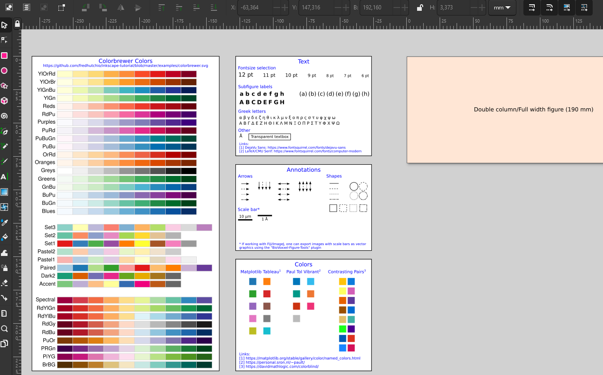

# Inkscape Scientific Figure Template

A simple Inkscape template for scientific figures 🎨

Contains sets of colors, text, and annotations to have a solid starting point for figure creation.

<a href="https://github.com/lukmuk/inkscape-scientific-figure-template/raw/main/Scientific_Figure_Template.svg" download>Download</a>




### Notes and other useful things

* [Colororacle](https://colororacle.org/index.html) to check visibility with vision impairments.
* The [Paul Tol](https://personal.sron.nl/~pault/) colors are used by the [SciencePlots](https://github.com/garrettj403/SciencePlots) package.
* Plugins: [TexText](https://github.com/textext/textext), [Scientific Inkscape](https://github.com/burghoff/Scientific-Inkscape), [inkscapeMadeEasy](https://github.com/fsmMLK/inkscapeMadeEasy), [ProPlot](https://proplot.readthedocs.io/en/latest/), ...

##### Fiji: Images to svg vector graphics

- Export via [Biovoxxel Figure Tools](https://github.com/biovoxxel/BioVoxxel-Figure-Tools#exporting-svg-vector-graphics-directly-from-fiji)
- Open the svg image in Inkscape
- Fiji annotations (e.g., scale bars from [em-scalebartools](https://github.com/lukmuk/em-scalebartools)) must be unlocked (Object -> Unlock All) and then ungrouped (Shift+Ctrl+G) for editing

##### Inkscape batch export to different formats

Figures may be needed in different file formats:

* An inital manuscript draft in Word may have smaller rasterized images (e.g., 300 dpi png) to reduce file size.
* A journal may require a specific file format during submission.

It can be tedious to manually export all figures to these formats. One can use the [Inkscape command line](https://wiki.inkscape.org/wiki/index.php/Using_the_Command_Line) to help with this issue. It can be used to batch export all svgs in a folder to the desired format!

- Prepare your Inkscape figure, set the figure area as the 'Page' in Inkscape by selecting the relevant figure area and using Shift+Ctrl+R ('Resize Page to Selection')
- I recommend putting a copy of each finalized figure in a separate folder, so that one has only the up-to-date svgs in it:  Figure-1.svg, Figure-2.svg, ...
- Start a terminal/Windows command line (type `cmd` in the address bar in Windows) in this folder and run the desired export command.

Examples: Batch export on Windows to 600 dpi (control via `-d 600`) PNGs. Run the following command from a folder containing the Inkscape SVGs:

```console
  for %f in (*.svg) do "C:\Program Files\Inkscape\bin\inkscape.com" --export-filename=%~nf.png -d 600 %~nf.svg
```

Export on Windows to PDF:

```console
for %f in (*.svg) do "C:\Program Files\Inkscape\bin\inkscape.com" --export-filename=%~nf.pdf %~nf.svg
```

Export on Windows to EPS:

```console
for %f in (*.svg) do "C:\Program Files\Inkscape\bin\inkscape.com" --export-filename=%~nf.eps %~nf.svg
```

##### File compression

- [OptiPNG](https://optipng.sourceforge.net/) - Lossless PNG file compression. Especially useful if you want to maximize quality of a PNG in an upload mask with a file-size limit (e.g., 500 kB for an abstract submission).  
  Batch conversion of all PNGs in a folder on Windows (copy the `optipng.exe` to the same folder):
  
  ```console
    for %f in (*.png) do optipng.exe %f
  ```

### Paper

* Jambor et al., *Creating Clear and Informative Image-Based Figures for Scientific Publications* PLOS Biology 2021, 19 (3), e3001161. https://doi.org/10.1371/journal.pbio.3001161.
* Crameri, Shephard and Heron *The Misuse of Colour in Science Communication* Nat Commun 2020, 11 (1), 5444. https://doi.org/10.1038/s41467-020-19160-7.
* Schmied et al. *Community-Developed Checklists for Publishing Images and Image Analysis* arXiv February 14, 2023. https://doi.org/10.48550/arXiv.2302.07005.
